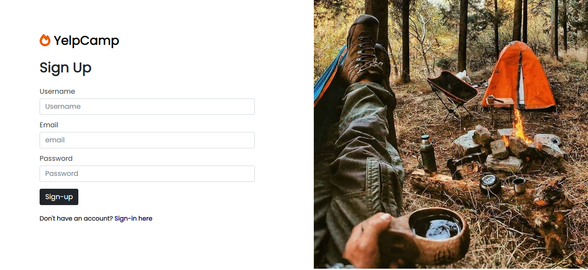

 

<!-- ABOUT THE PROJECT -->

## About The Project

Yelp Camp is a web application that allows you to view campgrounds with a short description. Once you login or signup you can begin to create your own campgrounds that includes a title, image, address and short description. Explore the beautiful world through this website.

### Project Images

#### Sign Up

#### Sign In

#### Home

#### All Campgrounds

#### New Campgrounds

#### About

(<a href="#top">back to top</a>)

### Built With

- [Express.js](https://expressjs.com/)
- [Nodejs](https://nodejs.org/en/)
- [EJS](https://ejs.co/)
- [MongoDB](https://www.mongodb.com/)
- 

(<a href="#top">back to top</a>)

<!-- CONTRIBUTING -->

## Contributing

Contributions are what make the open source community such an amazing place to learn, inspire, and create. Any contributions you make are **greatly appreciated**.

If you have a suggestion that would make this better, please fork the repo and create a pull request. You can also simply open an issue with the tag "enhancement".
Don't forget to give the project a star! Thanks again!

1. Fork the Project
2. Create your Feature Branch (`git checkout -b feature/AmazingFeature`)
3. Commit your Changes (`git commit -m 'Add some AmazingFeature'`)
4. Push to the Branch (`git push origin feature/AmazingFeature`)
5. Open a Pull Request

(<a href="#top">back to top</a>)

<!-- LICENSE -->

## License

Distributed under the MIT License. See `LICENSE.txt` for more information.

(<a href="#top">back to top</a>)

